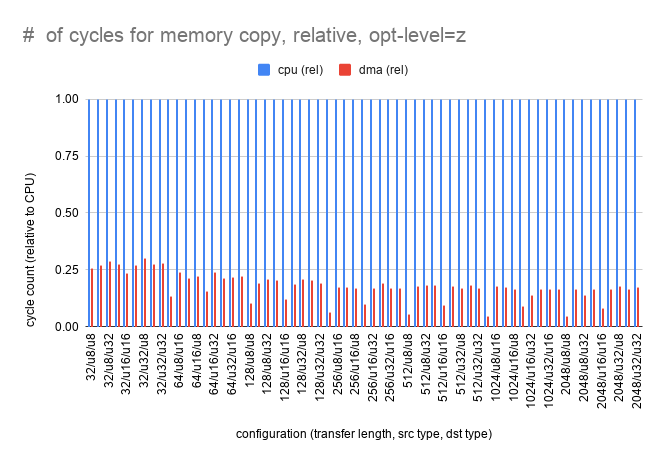

## stm32 DMA mem2mem benchmark

stm32 DMA hardward supports `mem2mem` mode, which copies data from memory to
memory, without CPU intervention. 
stm32 DMA supports three data width (8bit, 16bit, 32bit) for both
source/destination. It zero-fills or truncates data when source and destination
data differs. For example, when copying data from 8bit source to 16bit
destination, it fills upper byte to zero. Here's a DMA behavior from [reference manual](https://www.st.com/resource/en/reference_manual/cd00171190-stm32f101xx-stm32f102xx-stm32f103xx-stm32f105xx-and-stm32f107xx-advanced-arm-based-32-bit-mcus-stmicroelectronics.pdf)

### benchmark environments

The benchmark compares number of cycles required to copy data in memory, when using CPU and DMA hardware. It measures required cycles with following variants

 - method: copy with CPU, copy with DMA
 - transfer length: number of items need to be transfered, from 32 to 2048
 - source/destination data width: both source and destination could be one of (8bit, 16bit, 32bit), so there are 9 cases.
 - optimization level: `opt-level=s` or `opt-level=z`
 
The benchmark measures CPU cycles 8 times and prints average number of cycles took for a transfer.

DMA transfer cycles include DMA setup time (DMA register manipulation time).

### benchmark result

The result is generated from following environment

 - mcu: [stm32f103c8t6](https://www.st.com/en/microcontrollers-microprocessors/stm32f103c8.html)
 - board: [blue pill](https://stm32-base.org/boards/STM32F103C8T6-Blue-Pill.html)
 - clock speed: hclk=72MHz, pclk1=36MHz pclk2=72MHz sysclk=72MHz

Here's a observation

 - CPU throughput heavily depends on optimization level. `opt-level=z` is 3~4 times slower than `opt-level=s` for the task.
 - DMA is consistently faster than CPU, even with transfer length as small as 32.

You can check raw data from [here](https://docs.google.com/spreadsheets/d/1iOg4I35PF151aZD5q1E-PQ_e_L15BxEd3iZOeg8ihSc).

#### opt-level=s

#### opt-level=z

